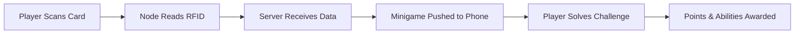

# 🌐 CYBER-WAR: RFID Capture the Flag

<div align="center">


**A pervasive, real-world team game blending physical hardware with digital web interfaces**

[Features](#-features) • [Hardware](#-hardware-requirements) • [Setup](#-server-installation-pc) • [How to Play](#-how-to-play) • [Troubleshooting](#-troubleshooting)

</div>

---

## 🎯 Features

- **Physical + Digital Gameplay** - Use RFID cards to trigger smartphone minigames
- **Real-time Competition** - WebSocket-powered instant updates across all devices
- **Team Strategy** - Coordinate attacks, abilities, and resource management
- **Portable Hardware** - Battery-powered nodes for anywhere gameplay
- **Game Master Controls** - Live scoring adjustments and match management

---

## 📖 Table of Contents

- [Project Overview](#-project-overview)
- [Hardware Requirements](#-hardware-requirements)
- [Wiring Guide](#-wiring-guide)
- [Server Installation](#-server-installation-pc)
- [Node Configuration](#-node-configuration-esp8266)
- [How to Play](#-how-to-play)
- [Troubleshooting](#-troubleshooting)

---

## 🔭 Project Overview

**Cyber-War** transforms physical spaces into competitive hacking arenas where players use real hardware to capture virtual territory.

### System Architecture

| Component | Description |
|-----------|-------------|
| **🖥️ Server** | Python Flask application managing game state, scores, and real-time WebSocket communication |
| **📡 Nodes** | ESP8266 microcontrollers with RFID readers acting as capture points and base stations |
| **📱 Client** | Smartphone web interface delivering instant minigames when cards are scanned |

### Game Flow



---

## 🛒 Hardware Requirements

### Bill of Materials

For a complete setup (1 Base Station + 3 Capture Points):

| Component | Quantity | Notes |
|-----------|----------|-------|
| **ESP8266 Board** | 4 | NodeMCU V3 or Wemos D1 Mini recommended |
| **MFRC522 RFID Reader** | 4 | RC522 module (13.56MHz) |
| **OLED Display** | 4 | 0.96" I2C SSD1306 128×64 |
| **RFID Cards/Tags** | As needed | 13.56MHz MIFARE compatible |
| **Jumper Wires** | 1 set | Female-to-Female & Male-to-Female |
| **Micro USB Cables** | 4 | For power and programming |
| **Power Banks** | 4 (optional) | For portable deployment |

### Optional Enhancements

- 3D printed enclosures for weather resistance
- LED status indicators
- Buzzers for audio feedback

---

## ⚡ Wiring Guide

Connect components to the ESP8266 (NodeMCU) following these diagrams.

> **⚠️ Warning:** Pin labels (D1, D2, etc.) refer to the NodeMCU silk screen labels.

### OLED Display (I2C Connection)

```
┌─────────────┐
│  OLED       │
│  SSD1306    │
└─────────────┘
  VCC  GND  SCL  SDA
   │    │    │    │
   │    │    │    └──── D2 (GPIO 4)
   │    │    └───────── D1 (GPIO 5)
   │    └────────────── GND
   └─────────────────── 3.3V
```

| OLED Pin | ESP8266 Pin | Function |
|----------|-------------|----------|
| **VCC** | 3.3V (or 5V) | Power |
| **GND** | GND | Ground |
| **SCL** | D1 (GPIO 5) | I2C Clock |
| **SDA** | D2 (GPIO 4) | I2C Data |

### RFID Reader (SPI Connection)

```
┌─────────────┐
│  RC522      │
│  RFID       │
└─────────────┘
 3.3V RST GND MISO MOSI SCK SDA
  │    │   │   │    │    │   │
  │    │   │   │    │    │   └─── D4 (GPIO 2)
  │    │   │   │    │    └─────── D5 (GPIO 14)
  │    │   │   │    └──────────── D7 (GPIO 13)
  │    │   │   └───────────────── D6 (GPIO 12)
  │    │   └───────────────────── GND
  │    └───────────────────────── D3 (GPIO 0)
  └────────────────────────────── 3.3V ⚠️ NOT 5V!
```

| RC522 Pin | ESP8266 Pin | Function |
|-----------|-------------|----------|
| **3.3V** | 3.3V | Power **⚠️ Do NOT use 5V** |
| **RST** | D3 (GPIO 0) | Reset |
| **GND** | GND | Ground |
| **IRQ** | *Not Connected* | Interrupt (Unused) |
| **MISO** | D6 (GPIO 12) | Master In Slave Out |
| **MOSI** | D7 (GPIO 13) | Master Out Slave In |
| **SCK** | D5 (GPIO 14) | Serial Clock |
| **SDA (SS)** | D4 (GPIO 2) | Slave Select |

### 🔌 Construction Tips

> **⚠️ Critical:** If your OLED or RFID module requires 3.3V, do NOT connect directly to ESP8266's 5V pin. Use a voltage divider with resistors or a logic level converter to prevent damage.

1. **Prototype First** - Assemble on a breadboard and test all connections before soldering
2. **Power Stability** - Ensure your USB power source provides stable current for all components
3. **Cable Management** - Use short jumper wires to minimize signal interference
4. **Enclosures** - 3D print or use plastic project boxes to protect electronics during gameplay

---

## 💻 Server Installation (PC)

Deploy the game server on a laptop or Raspberry Pi connected to the same WiFi network as your ESP8266 nodes.

### Prerequisites

- [Python 3.8+](https://www.python.org/downloads/)
- [Git](https://git-scm.com/downloads)
- WiFi network with static IP for the server (recommended)

### Installation Steps

<details>
<summary><b>Windows</b></summary>

```powershell
# 1. Clone the repository
git clone https://github.com/Maciasssss/Game-Off-Road-Hacking.git
cd Game-Off-Road-Hacking

# 2. Create virtual environment
python -m venv venv
venv\Scripts\activate

# 3. Install dependencies
pip install flask flask-socketio eventlet

# 4. Run the server
python app.py

# 5. Find your IP address
ipconfig
# Look for "IPv4 Address" (e.g., 192.168.1.15)
```
</details>

<details>
<summary><b>macOS / Linux</b></summary>

```bash
# 1. Clone the repository
git clone https://github.com/Maciasssss/Game-Off-Road-Hacking.git
cd Game-Off-Road-Hacking

# 2. Create virtual environment
python3 -m venv venv
source venv/bin/activate

# 3. Install dependencies
pip install flask flask-socketio eventlet

# 4. Run the server
python app.py

# 5. Find your IP address
ifconfig  # or: ip a
# Look for your network interface IP (e.g., 192.168.1.15)
```
</details>

### Accessing the Server

Once running, players connect to: `http://YOUR_IP_ADDRESS:5000`

> **Example:** If your IP is `192.168.1.15`, connect to `http://192.168.1.15:5000`

---

## 📡 Node Configuration (ESP8266)

Program each ESP8266 to communicate with the game server.

### 1. Arduino IDE Setup

<details>
<summary>Click to expand setup instructions</summary>

1. Download and install [Arduino IDE](https://www.arduino.cc/en/software)
2. Add ESP8266 board support:
   - Go to **File → Preferences**
   - Add to "Additional Boards Manager URLs":
     ```
     http://arduino.esp8266.com/stable/package_esp8266com_index.json
     ```
3. Install ESP8266 board:
   - Go to **Tools → Board → Boards Manager**
   - Search for `esp8266` and install
4. Install required libraries:
   - Go to **Tools → Manage Libraries**
   - Install the following:
     - `MFRC522` by GithubCommunity v.1.4.12
     - `Adafruit SSD1306` v.2.5.16
     - `Adafruit GFX Library` v.1.12.14
     - `ArduinoJson` v.7.4.2
     - `SocketIoClient` by Vincent Wyszynski v.0.3.0

</details>

### 2. Configure Node Code

A. Open `NodeCode.ino` from the `/arduino` folder and modify:

```cpp
// WiFi credentials
const char* ssid     = "YOUR_WIFI_NAME";
const char* password = "YOUR_WIFI_PASSWORD";

// Server connection (use your computer's IP from Step 5 above)
char host[] = "192.168.1.15";  // ← Change this!
int port = 5000;

// Node identifier (change for each board)
String nodeId = "node_alpha";  // Options: node_alpha, node_beta, node_gamma, base_station
```
B. RFID "Nugget" Configuration (Critical!)
The game uses 4 specific physical RFID tags as "Nuggets" (Red 1, Red 2, Blue 1, Blue 2). 
The code contains hardcoded UIDs for these items (variables r1, r2, b1, b2). You must update them to match your physical tags.

**How to find your Tag IDs:**
1. Upload the code to the ESP8266 (see Step 3 below).
2. Open Tools → Serial Monitor (set baud rate to 115200).
3. Scan your RFID tags one by one.
4. The Serial Monitor will print the UID of the scanned tag (e.g., UID: 34 C5 11 A2).
5. Copy these UIDs and replace the values in app.py:
```cpp
CARD_MAPPING = {
    "77286D06": "R1", "55AE6C06": "R2", "16CA3253": "B1", "A6636D06": "B2"
}
```
### 3. Upload to ESP8266

| Node | nodeId Value | Purpose |
|------|--------------|---------|
| Node 1 | `"base_station"` | Battery recharge station |
| Node 2 | `"node_alpha"` | Capture point |
| Node 3 | `"node_beta"` | Capture point |
| Node 4 | `"node_gamma"` | Capture point |

**Upload Process:**
1. Connect ESP8266 via USB
2. Select **Tools → Port** (COM port on Windows, `/dev/tty*` on macOS/Linux)
3. Select **Tools → Board → NodeMCU 1.0 (ESP-12E Module)**
4. Click the **Upload** button (→)
5. Wait for "Done uploading" message
6. Repeat for all 4 nodes with different `nodeId` values

---

## 🎮 How to Play

### Game Objective

**Two teams (RED 🔴 and BLUE 🔵) compete to control nodes. First team to 1000 points wins!**

### Setup Phase

1. **Start the Server**
   ```bash
   python app.py
   ```

2. **Connect Players**
   - Join the same WiFi network
   - Navigate to `http://SERVER_IP:5000`
   - Enter your card code (e.g., `R1`, `B2`)

3. **Game Master Initialization**
   - First player to log in becomes Game Master (GM)
   - GM clicks **START MATCH** in settings (⚙️ icon)

### Gameplay Loop

```
1. CHARGE  →  2. SCAN  →  3. HACK  →  4. EARN
```

#### 1. ⚡ CHARGE
- Battery drains during hacks
- Run to **Base Station** node
- Scan your card to recharge

#### 2. 📡 SCAN
- Approach any capture point (Alpha, Beta, Gamma)
- Tap your RFID card on the reader
- Wait for confirmation beep/display

#### 3. 🎯 HACK
- Minigame appears on your phone instantly
- Solve puzzles: code breaking, wiring, math, memory
- Speed determines rewards:

| Time | Points | Shield Duration |
|------|--------|-----------------|
| **< 3s** (Fast) | High | Long |
| **3-8s** (Normal) | Standard | Medium |
| **> 8s** (Slow) | Low | Short |

#### 4. 💎 EARN
- Successful hacks award points and Ability Points (AP)
- Failed hacks = no rewards, battery still drains

### Special Abilities

Open the **Book Menu** (📖) to spend AP:

| Ability | Cost | Effect |
|---------|------|--------|
| 🔋 **Instant Charge** | 3 AP | Fill battery remotely |
| 💥 **EMP** | 5 AP | Destroy enemy shields |
| ❄️ **Jammer** | 4 AP | Freeze enemy screens for 10s |

### Game Master Controls

The GM can access additional controls via the **Gear Menu** (⚙️):

- Rename teams
- Adjust scoring multipliers
- Force-end match
- **Restart Match** - Saves current game to leaderboard history and resets

> **Note:** If GM disconnects, the next player to log in/refresh automatically becomes GM.

---

## 🔧 Troubleshooting

### Connection Issues

<details>
<summary><b>"Connection Refused" or site won't load</b></summary>

**Checklist:**
- [ ] Server and devices on same WiFi network
- [ ] Firewall allows `python.exe` on public/private networks
  - Windows: Control Panel → Windows Defender Firewall → Allow an app
- [ ] Server is running (`python app.py` showing no errors)
- [ ] Correct IP address used (not 127.0.0.1 or localhost)

</details>

<details>
<summary><b>Node screen shows "WiFi Connecting..." forever</b></summary>

**Solutions:**
1. Verify SSID and password in `NodeCode.ino` (case-sensitive!)
2. Check WiFi signal strength at node location
3. Ensure WiFi network uses 2.4GHz (ESP8266 doesn't support 5GHz)
4. Try moving node closer to router
5. Check Serial Monitor (Tools → Serial Monitor, 115200 baud) for error messages

</details>

### Hardware Issues

<details>
<summary><b>Node says "Connected" but card scans don't work</b></summary>

**Troubleshooting:**
1. Verify `host[]` IP matches server's current IP in `NodeCode.ino`
2. Confirm server is running
3. Check RFID wiring - SDA must be on **D4**, not D2
4. Test RFID reader independently using example sketches
5. Ensure card is held close (< 3cm) to reader

</details>

<details>
<summary><b>"Card ID Unknown" error</b></summary>

**Fix:**
1. Open Serial Monitor while tapping cards to see UIDs
2. Edit `app.py` and find `CARD_MAPPING` dictionary
3. Add your card UIDs:
   ```python
   CARD_MAPPING = {
       "1A2B3C4D": "R1",  # Red Team Player 1
       "5E6F7G8H": "B1",  # Blue Team Player 1
       # Add your UIDs here
   }
   ```
4. Restart server

</details>

<details>
<summary><b>OLED display not working</b></summary>

**Common Causes:**
- Wrong I2C address (try 0x3C or 0x3D in code)
- Loose connections on SDA/SCL pins
- Insufficient power - try external power supply
- Faulty display - test with I2C scanner sketch

</details>

---

## 📜 License

This project is licensed under the MIT License - see the [LICENSE](LICENSE) file for details.

---
<div align="center">

⭐ Star this repo if you found it helpful!

</div>
